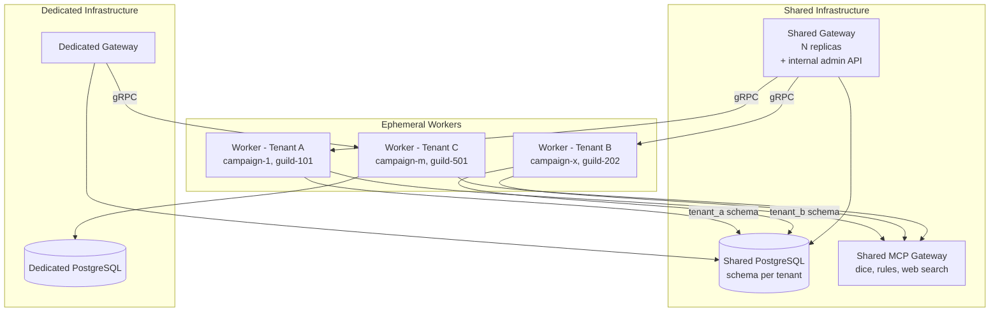

# Production Scaling & Multi-Tenant Deployment

## Enhancement Summary

**Deepened on:** 2026-03-05
**Research agents used:** Architecture Review, Security Review, Performance Review, Data Integrity Review, Deployment Verification, Best Practices Research, Pattern Analysis, Simplicity Review
**Sections enhanced:** All 5 phases + cross-cutting concerns

### Key Improvements

1. **Admin API auth model defined (P1-001)**: API key auth for admin API, mTLS for gateway-worker gRPC, RBAC roles (platform-admin, tenant-admin) documented in Phase 1.1
2. **Schema name injection prevented (P1-003)**: `SchemaName` type with regex validation + `pgx.Identifier.Sanitize()` in Phase 1.3 — impossible to pass unvalidated string into SQL
3. **campaign_id column added (P1-005)**: `campaign_id TEXT NOT NULL` on all data tables + composite PK for entities in Phase 1.2 — no migration needed, DBs created fresh
4. **Session states simplified (P1-004)**: 3 states (pending/active/ended) with `WHERE state != 'ended'` — no index coverage gaps possible
5. **RLS removed (P1-002)**: Schema GRANT/REVOKE is the sole isolation boundary — no false security from `USING(true)`
6. **PgBouncer deferred (P1-006)**: Direct pgxpool at launch; `QueryExecModeSimpleProtocol` documented for when PgBouncer is added
7. **Deployment prerequisites reordered**: Health probes in Phase 0 (before Phase 1); gateway RBAC defined in Phase 3.1; worker-to-gateway addressing specified
8. **Migration tooling resolved (P2-011)**: golang-migrate selected with per-schema version tracking and advisory locks
9. **SessionRuntime extracted (P2-012)**: Dedicated struct owns voice pipeline lifecycle, used by full and worker modes
10. **BotManager thread safety (P2-010)**: `botEntry` struct with WaitGroup, correct lock scoping on RouteEvent and RemoveBot
11. **Circuit breaker on WorkerClient (P3-014)**: gRPC client wrapped with CircuitBreaker per worker connection
12. **GIN FTS index added (P3-013)**: `idx_chunks_fts` on chunks table for full-text search

### Simplifications Applied

Research consensus recommended significant scope reduction for launch. The following simplifications have been **APPLIED** to this plan:

| Item | Action | Impact |
|------|--------|--------|
| 4 license tiers | APPLIED: Collapsed to 2 (Shared/Dedicated) | Eliminates half the partial indexes, simplifies tier logic |
| 9-state session machine | APPLIED: Simplified to 3 states (pending/active/ended) | Fewer transitions, fewer race conditions |
| Custom K8s operator (Phase 5) | APPLIED: Removed, one-line Future Consideration | ~80% Phase 5 reduction |
| KEDA autoscaling | APPLIED: Removed, use HPA or manual replicas | One fewer cluster dependency |
| RLS defense-in-depth | APPLIED: Removed (schema GRANT/REVOKE is the isolation boundary) | ~10 lines DDL per schema removed |
| Campaign export | APPLIED: Moved from Phase 1 to Phase 4 | Phase 1 shrinks ~20% |
| PgBouncer | APPLIED: Deferred until connection pressure observed | One fewer deployment component |
| Separate control plane | APPLIED: Merged into gateway | One fewer service |
| Vault + ESO | APPLIED: Sealed Secrets for launch | Significant operational simplification |
| Stripe integration | APPLIED: Payment Links + manual tier for launch | Phase 4 shrinks ~25% |
| Terraform/Crossplane | APPLIED: Manual runbook for launch | One fewer tool dependency |

**Estimated total reduction:** ~35% of plan scope. The minimum viable production architecture is: TenantContext + campaign_id + schema-per-tenant + gateway/worker binary modes + Helm chart with Jobs + Sealed Secrets + basic observability + two tiers (Shared/Dedicated).

---

## Overview

Transform Glyphoxa from a single-guild alpha into a scalable, multi-tenant
production SaaS while preserving the single-process self-hosted path
(`--mode=full`) as the open-source story.

This plan covers five phases: core tenant model, gateway/worker split,
Kubernetes infrastructure, observability/billing, and scale polish. Each
phase builds on the previous one, with clear acceptance criteria and quality
gates.

**Source brainstorm:**
`docs/brainstorms/production-scaling.md` (80KB, 16 sections, all questions
resolved 2026-03-05).

## Problem Statement

Glyphoxa today is a single-process, single-guild, single-campaign
application with no tenant concept. Every subsystem -- database, config,
Discord bot, session manager, MCP tools, observability -- assumes a single
user. Voice transcripts are highly sensitive data. Cross-tenant leakage is
unacceptable at any tier.

### Current State vs Production Requirements

| Aspect | Current | Required |
|--------|---------|----------|
| Tenant model | None | Tenant = Customer = License, integrated into every subsystem |
| Database | Shared tables, no isolation | Schema-per-tenant (Shared) or dedicated instance (Dedicated) |
| Discord | 1 bot, 1 guild, in-process | Multi-bot gateway, multi-guild, shared or dedicated per tier |
| Sessions | In-memory singleton, 1 active | PostgreSQL-backed, license-constrained, distributed |
| Config | Single YAML file | Per-tenant config via gateway admin API |
| Secrets | YAML / env vars | Sealed Secrets (Vault when compliance requires it) |
| Observability | Packages exist but not wired | Per-tenant metrics, traces, logs; Prometheus + Loki + Tempo |
| Deployment | Docker Compose | Kubernetes with gateway + ephemeral worker pods |

## Proposed Solution

### Architecture: Gateway + Session Workers

The Glyphoxa binary gains a `--mode` flag with three values:

- **`--mode=full`** (default): Single-process, no admin API, config from
  YAML. Current alpha behaviour. The open-source self-hosted deployment.
- **`--mode=gateway`**: Discord gateway connections, slash command routing,
  session orchestration, internal admin API on a separate port behind
  NetworkPolicy. Always running. Communicates with workers via gRPC.
- **`--mode=worker`**: Voice pipeline (VAD -> STT -> LLM -> TTS -> mixer).
  Ephemeral -- created per session, destroyed on session end.

A Go interface defines the gateway<->worker contract. Two implementations:
gRPC (distributed) and direct function calls (full mode). No latency penalty
for self-hosters.

### License Tiers

| | Shared | Dedicated |
|---|---|---|
| **Campaigns** | Config value (default: 3) | Unlimited |
| **Sessions** | Config value (default: 1 per tenant) | Config value (default: 1 per guild, parallel across guilds) |
| **Voice isolation** | Logical | Physical |
| **DB isolation** | Shared instance, per-tenant schema | Dedicated instance |
| **Gateway** | Shared | Dedicated |

Granularity within tiers (campaign limits, session hour quotas) is controlled
by config values on the tenant row, not by tier-level logic.

### Research Insights: License Tiers

**Applied: Collapsed to two tiers for launch -- Shared and Dedicated.** Four tiers meant four codepaths for isolation, four sets of constraints, four deployment topologies. The differences between Starter/Standard and between Pro/Business were minor and are now config values on the tenant row (campaign limits, session hour quotas) rather than tier-level logic. Add granularity when customer demand justifies it.

### Tenant Isolation Model

```
Shared tier (shared infrastructure):
  Shared Gateway Pool --> Worker Pods (ephemeral, 1 per session)
                     --> Shared PostgreSQL (per-tenant schema + GRANT/REVOKE)
                     --> Shared MCP Gateway (stateless tools)

Dedicated tier (dedicated infrastructure):
  Dedicated Gateway --> Dedicated Worker Pods
                   --> Dedicated PostgreSQL instance
                   --> Shared MCP Gateway + optional dedicated DB-access MCP
```

## Technical Approach

### Architecture



### Research Insights: Architecture

**Applied: Control plane merged into gateway.** The control plane's responsibilities (tenant CRUD, session orchestration, config management, license enforcement) are all things the gateway already needs. The gateway exposes an internal-only admin API on a separate port behind a NetworkPolicy. Extract only when independent scaling is needed.

**Applied: Phase 0 prerequisite added.** Wire `internal/observe/` and `internal/health/` into `cmd/glyphoxa/main.go` before any multi-tenant work. See Phase 0 above.

**Applied: Existing resilience patterns wired.** The circuit breaker at `internal/resilience/circuitbreaker.go` is now specified for the gRPC `WorkerClient` in Phase 2.1.

### Implementation Phases

---

#### Phase 0: Observability & Health (prerequisite for all phases)

The observe and health packages exist (`internal/observe/`, `internal/health/`)
but are not wired into the application. Wire them now to get immediate
visibility during development and to unblock Kubernetes deployment (Phase 3).

**Changes to `cmd/glyphoxa/main.go`:**
1. Call `observe.InitProvider()` at startup to register Prometheus exporter
   and optional OTLP trace exporter
2. Start HTTP server on `:9090` (configurable) serving `/healthz`,
   `/readyz`, `/metrics`

**Health probe definitions:**
- **Gateway readiness:** DB pool healthy + at least one Discord bot connected
- **Worker readiness:** DB pool healthy + Discord voice connected + providers
  initialized
- **Startup probe:** 60s budget (`failureThreshold: 30`, `periodSeconds: 2`)
  to allow for ONNX runtime and model loading

**Files to modify:**
- `cmd/glyphoxa/main.go` (wire `observe.InitProvider`, start HTTP server)
- `internal/app/app.go` (accept `observe.Metrics` in constructor, register
  readiness checks)

---

#### Phase 1: Core Tenant Model (prerequisite for everything else)

The tenant model must be deeply integrated before any other production work.
Every database query, log line, metric, and MCP tool call must be
tenant-scoped.

##### 1.1 Define TenantContext and LicenseTier

Add core tenant types to `internal/config/`:

```go
// internal/config/tenant.go
type LicenseTier int

const (
    TierShared LicenseTier = iota
    TierDedicated
)

type TenantContext struct {
    TenantID    string
    LicenseTier LicenseTier
    CampaignID  string
    GuildID     string
    SchemaName  SchemaName // postgres schema; directly corresponds to TenantID ("local" for full mode)
}
```

Propagate via `context.Value` with a typed key. Add helper functions:
`TenantFromContext(ctx)`, `WithTenant(ctx, tc)`.

**Full-mode compatibility:** In `--mode=full`, `TenantContext` is populated
at startup from config: `TenantID = "local"`, `SchemaName = "local"`,
`CampaignID` from `cfg.Campaign.Name`, `LicenseTier = TierShared` (no
enforcement). The schema name directly corresponds to the tenant ID.

**Admin API authentication (P1 prerequisite):** The gateway exposes an
internal admin API on a separate port (e.g., `:8081`) for tenant CRUD,
session management, and config retrieval. Authentication model:

- **Admin API (external):** API key authentication. Each platform admin
  has a long-lived API key stored in a Sealed Secret. Keys are validated
  via a middleware that checks against a `platform_admins` table. For
  launch, a single admin key set via env var is sufficient.
- **Gateway <-> Worker gRPC:** mTLS with certificates issued per-pod via
  cert-manager. The gateway CA is baked into the worker Job spec. Workers
  cannot impersonate the gateway (separate certificate profiles).
- **RBAC roles:** `platform-admin` (full access), `tenant-admin` (own
  tenant only, scoped by tenant_id in API key claims). Add
  `tenant-member` later when self-service dashboard exists.
- **Audit:** All admin API mutations (tenant create/delete, tier change,
  secret rotation) produce structured log entries with `admin_id`,
  `action`, `tenant_id`, and timestamp.

```go
// internal/gateway/admin.go
type AdminAPI struct {
    mux    *http.ServeMux
    store  AdminStore
    apiKey string // single admin key for launch; replace with DB lookup later
}
```

**Files to modify:**
- `internal/config/tenant.go` (new)
- `internal/gateway/admin.go` (new -- admin API handler)
- `internal/app/app.go:129` (`New()` -- accept TenantContext)
- `internal/app/session_manager.go:116` (`Start()` -- set tenant in context)

### Research Insights: TenantContext

**Context key must use unexported struct type.** The plan does not specify the key type. The implementation must use `type tenantCtxKey struct{}`, not a string key. String keys cause cross-package collisions and are a known Go anti-pattern. This is critical because the codebase currently has zero uses of `context.Value` -- this is a new pattern being introduced.

**LicenseTier int vs TEXT mismatch.** The Go code uses `iota` (int) but the sessions table stores `license_tier TEXT`. Add a `String()` method on `LicenseTier` and use it consistently for database storage, or use string constants instead of iota. The codebase uses the same pattern for `resilience.State` -- follow that precedent.

**Tenant ID validation.** The tenant ID is used as a PostgreSQL schema name (`tenant_<id>`). It must be validated at construction time to prevent SQL injection. Enforce: `^[a-z][a-z0-9_]{0,62}$` (alphanumeric + underscore, starts with letter, max 63 chars for PostgreSQL identifier limits).

**Tenant context propagation in gRPC.** Tenant ID should travel in gRPC metadata (analogous to HTTP headers). A server unary interceptor extracts `tenant-id` from `metadata.FromIncomingContext(ctx)`, validates it, and injects it into context. For streaming RPCs, use a `wrappedStream` that overrides `Context()` -- the `go-grpc-middleware` library provides `WrappedServerStream` for this.

##### 1.2 Add campaign_id to the Data Model

Add `campaign_id TEXT NOT NULL` column to all data tables:
`session_entries`, `chunks`, `entities`, `relationships`.

**No migration from alpha schema required.** Databases will be created fresh
after this plan is implemented. There is no existing alpha data to migrate.
The initial schema DDL includes `campaign_id` from the start:

```sql
-- campaign_id is part of the initial schema, not a migration
-- All tables include campaign_id TEXT NOT NULL in their CREATE TABLE DDL

-- Indexes created alongside tables
CREATE INDEX idx_session_entries_campaign ON session_entries (campaign_id);
CREATE INDEX idx_chunks_campaign ON chunks (campaign_id);

-- GIN full-text search index on chunks (required for FTS queries)
CREATE INDEX IF NOT EXISTS idx_chunks_fts
    ON chunks USING GIN (to_tsvector('english', content));
```

**Entity primary key decision:** The `entities` table uses a composite
primary key `(campaign_id, id)` from the start. Two campaigns may have
entities with the same name (e.g., "Grimjaw"). The composite PK cascades to
foreign keys in `relationships` (`source_id`, `target_id`), which use
composite references `(campaign_id, source_id)` and `(campaign_id, target_id)`.

All queries gain a `WHERE campaign_id = $1` filter. The session worker is
bound to a single campaign and never sees other campaigns' data.

**Files to modify:**
- `pkg/memory/postgres/schema.go` (DDL: add column + indexes)
- `pkg/memory/postgres/session_store.go` (all queries: add campaign_id filter)
- `pkg/memory/postgres/semantic_index.go` (Search, Store: campaign_id filter)
- `pkg/memory/postgres/knowledge_graph.go` (all CRUD: campaign_id filter)
- `pkg/memory/store.go` (interfaces: add campaign_id to method signatures or
  to constructor)

**Design decision:** Campaign ID flows via constructor (set once when the
store is created for a session), not per-method. This prevents accidentally
omitting the filter on a single query.

```go
// pkg/memory/postgres/store.go
type Store struct {
    pool       *pgxpool.Pool
    campaignID string  // set at construction, used in all queries
    schema     string  // "public" for full-mode, "tenant_xxx" for multi-tenant
}
```

### Research Insights: campaign_id Schema Design

**No alpha migration needed.** Databases will be created fresh after this plan is implemented. The `campaign_id` column is part of the initial schema DDL, eliminating migration complexity entirely.

**Entity primary key:** The composite primary key `(campaign_id, id)` on `entities` prevents name collisions across campaigns. This cascades to all foreign keys in `relationships`.

**Transaction boundaries needed.** Current `knowledge_graph.go` performs multi-step reads without transactions (`VisibleSubgraph`, `IdentitySnapshot`). In multi-tenant production with concurrent sessions, this causes inconsistent snapshots. Wrap multi-query reads in `REPEATABLE READ` read-only transactions.

**Schema name in SQL queries.** The schema name is interpolated into SQL strings (`fmt.Sprintf("%s.session_entries", s.schema)`) because PostgreSQL does not support parameterized schema names. Validate at Store construction time with the regex `^[a-z][a-z0-9_]{0,62}$` to prevent SQL injection.

##### 1.3 Schema-Per-Tenant Database Migration

**Schema name validation (P1 prerequisite):** Schema names are interpolated
into SQL because PostgreSQL does not support parameterized identifiers. A
dedicated `SchemaName` type enforces validation at construction, making it
impossible to pass an unvalidated string into SQL:

```go
// pkg/memory/postgres/schema_name.go
package postgres

import (
    "fmt"
    "regexp"

    "github.com/jackc/pgx/v5"
)

var validSchema = regexp.MustCompile(`^[a-z][a-z0-9_]{0,62}$`)

// SchemaName is a validated PostgreSQL schema identifier.
// Construction via NewSchemaName is the only way to obtain one.
type SchemaName struct{ name string }

func NewSchemaName(raw string) (SchemaName, error) {
    if !validSchema.MatchString(raw) {
        return SchemaName{}, fmt.Errorf("postgres: invalid schema name: %q", raw)
    }
    return SchemaName{name: raw}, nil
}

// TableRef returns a fully-qualified, properly quoted table reference.
func (s SchemaName) TableRef(table string) string {
    return pgx.Identifier{s.name, table}.Sanitize()
}

func (s SchemaName) String() string { return s.name }
```

All DDL and queries use `s.schema.TableRef("session_entries")` instead of
raw `fmt.Sprintf`. The `Store` constructor accepts `SchemaName` (not a raw
string), ensuring validation happens exactly once at creation time.

**Migration versioning (RESOLVED: golang-migrate selected):**

Use [`golang-migrate`](https://github.com/golang-migrate/migrate) for schema
migrations. It is lightweight, Go-native, requires no external binary, and
supports embedded migration files via `embed.FS`.

- **Per-schema version tracking:** A `schema_migrations` table in the gateway
  database tracks migration state per tenant schema:
  ```sql
  CREATE TABLE IF NOT EXISTS schema_migrations (
      schema_name TEXT NOT NULL,
      version     BIGINT NOT NULL,
      dirty       BOOLEAN NOT NULL DEFAULT false,
      applied_at  TIMESTAMPTZ NOT NULL DEFAULT now(),
      PRIMARY KEY (schema_name, version)
  );
  ```
- **Advisory locks per schema:** Acquire `pg_advisory_lock(hashtext(schema_name))`
  before running migrations to prevent concurrent migration on the same schema.
- **Migration files:** `pkg/memory/postgres/migrations/` with numbered files
  (`000001_initial.up.sql`, etc.). Embedded via `//go:embed migrations/*.sql`.

Modify `postgres.Migrate()` to read the schema name from context via
`TenantContext.SchemaName`. This ensures the schema is always consistent
with the tenant identity propagated through the call chain:

```go
// pkg/memory/postgres/schema.go
func Migrate(ctx context.Context, pool *pgxpool.Pool) error {
    tc := config.TenantFromContext(ctx)
    schema := tc.SchemaName // "local" for full-mode, "tenant_xxx" for multi-tenant
    // Use schema.TableRef("table") for fully-qualified table names in DDL
    // This avoids search_path issues
}
```

The `SchemaName` field on `TenantContext` directly corresponds to the tenant
ID. In `--mode=full`, the schema name is `"local"` (matching
`TenantID = "local"`). In multi-tenant mode, the schema name is derived from
the tenant ID (e.g., `tenant_acme` for tenant `acme`). This derivation
happens once at `TenantContext` construction time.

**Critical design decision (from SpecFlow Q1):** Use **fully-qualified table
names** (`tenant_xxx.session_entries`) in all queries rather than relying on
`SET search_path`. This is safe with connection pooling because no
session-level state is required.

**Isolation boundary:** Schema-level GRANT/REVOKE is the isolation boundary.
The worker's DB role is restricted to its tenant's schema via PostgreSQL RBAC
(`GRANT USAGE ON SCHEMA tenant_xxx TO worker_role`). RLS is unnecessary
overhead when using schema-per-tenant -- each schema is already isolated by
database permissions.

**Files to modify:**
- `pkg/memory/postgres/schema_name.go` (new -- SchemaName type with validation)
- `pkg/memory/postgres/schema.go` (parameterize schema name, use SchemaName)
- `pkg/memory/postgres/store.go` (accept SchemaName in constructor)
- `pkg/memory/postgres/session_store.go` (use TableRef for all queries)
- `pkg/memory/postgres/semantic_index.go` (use TableRef for all queries)
- `pkg/memory/postgres/knowledge_graph.go` (use TableRef for all queries)

### Research Insights: Schema Isolation & Migration

**Applied: RLS removed.** All review agents agreed that `USING(true)` was a no-op providing zero additional isolation. Schema-level GRANT/REVOKE is the real isolation boundary. Removing RLS eliminates overhead on every row access and a false sense of security.

**Applied: Migration versioning specified.** golang-migrate selected with per-schema version tracking in `schema_migrations(schema_name, version, applied_at)` and advisory locks per schema. See Phase 1.3 above for details.

**Scale limits.** Schema-per-tenant works well for 10 to a few thousand tenants. Beyond ~5,000 schemas, expect longer query planning times and higher memory usage. At that point, consider Citus schema-based sharding.

**pgvector index tuning.** For small tenants (<500 vectors), consider deferring HNSW index creation -- exact nearest-neighbor search is fast enough. When created, specify parameters explicitly:
```sql
CREATE INDEX ... USING hnsw (embedding vector_cosine_ops)
    WITH (m = 16, ef_construction = 64);
```
At 100+ schemas, autovacuum must track 400+ tables. Ensure `autovacuum_max_workers` is configured appropriately.

**Acceptance criteria:**
- [x] Two tenants created with separate schemas; queries for tenant A never
  return tenant B's data
- [x] All existing tests pass with `campaign_id` threaded through
- [x] `--mode=full` continues to work with `tenant_id=local`, `schema=public`

---

#### Phase 2: Gateway / Worker Split

##### 2.1 Define the gRPC Service Contract

Create protobuf definitions for the gateway<->worker boundary.

**New file:** `proto/glyphoxa/v1/session.proto`

```protobuf
syntax = "proto3";
package glyphoxa.v1;

service SessionWorker {
  // Gateway -> Worker
  rpc StartSession(StartSessionRequest) returns (StartSessionResponse);
  rpc StopSession(StopSessionRequest) returns (StopSessionResponse);
  rpc GetStatus(GetStatusRequest) returns (GetStatusResponse);
}

service SessionGateway {
  // Worker -> Gateway (callbacks)
  rpc ReportState(ReportStateRequest) returns (ReportStateResponse);
  rpc Heartbeat(HeartbeatRequest) returns (HeartbeatResponse);
}
```

Define a Go interface that both the gRPC client and the in-process
implementation satisfy:

```go
// internal/gateway/contract.go
type WorkerClient interface {
    StartSession(ctx context.Context, req *StartSessionRequest) error
    StopSession(ctx context.Context, req *StopSessionRequest) error
    GetStatus(ctx context.Context) (*SessionStatus, error)
}

type GatewayCallback interface {
    ReportState(ctx context.Context, sessionID string, state SessionState) error
    Heartbeat(ctx context.Context, sessionID string) error
}
```

Two implementations:
- `internal/gateway/grpc/` -- wraps gRPC client/server (distributed mode)
- `internal/gateway/local/` -- direct function calls (full mode)

**Circuit breaker on WorkerClient:** Each gRPC worker connection is wrapped
with the existing `CircuitBreaker` from `internal/resilience/circuitbreaker.go`
to fast-fail on unhealthy workers instead of waiting for gRPC timeouts:

```go
// internal/gateway/grpc/client.go
type grpcClient struct {
    conn    *grpc.ClientConn
    breaker *resilience.CircuitBreaker
}
```

The breaker opens after consecutive gRPC failures, allowing the gateway to
skip unhealthy workers and reschedule sessions immediately.

### Research Insights: gRPC Design

**Interceptor architecture.** Use `go-grpc-middleware` for chaining interceptors. Chain order: context injection -> auth -> logging -> tracing -> rate limiting -> validation -> handler. Tenant ID propagates via gRPC metadata, extracted by a server interceptor.

**Compile-time interface assertions.** Per codebase convention (80+ instances), add `var _ WorkerClient = (*grpcClient)(nil)` in each implementation file.

**Applied: Circuit breaker on WorkerClient.** The `grpcClient` struct wraps each worker connection with `internal/resilience/CircuitBreaker`. See Phase 2.1 above for the implementation.

**Health checking via native gRPC probes.** Kubernetes 1.24+ supports native gRPC health probes (GA). Register `health.NewServer()` with `grpc_health_v1.RegisterHealthServer()`:
```yaml
readinessProbe:
  grpc:
    port: 50051
```

**Audio streaming consideration.** For real-time audio, consider bidirectional gRPC streaming between gateway and worker. Audio frames (20ms Opus packets from Discord) flow as a continuous stream -- no batch-and-send. Pipeline stages (STT -> LLM -> TTS) must overlap, not execute sequentially. Connection reuse is critical -- pre-establish at session start.

##### 2.2 Refactor cmd/glyphoxa into Three Modes

Restructure `cmd/glyphoxa/main.go` to support `--mode` flag:

```go
func main() {
    mode := flag.String("mode", "full", "Run mode: full, gateway, worker")
    // ...
    switch *mode {
    case "full":
        runFull(cfg)       // current behaviour, local WorkerClient
    case "gateway":
        runGateway(cfg)    // Discord + session orchestration + admin API + gRPC server
    case "worker":
        runWorker(cfg)     // voice pipeline + gRPC client to gateway
    }
}
```

**Gateway responsibilities:**
- Discord gateway WebSocket connections (multi-bot for shared mode)
- Slash command handling (`/session`, `/npc`, `/entity`, `/campaign`)
- Session lifecycle: validate license -> create worker -> monitor health
- License constraint enforcement
- Config management (per-tenant NPC definitions, campaign metadata)
- Internal admin API on a separate port (tenant CRUD, session management)

**Worker responsibilities:**
- Voice channel join/leave (worker connects to Discord voice directly)
- VAD -> STT -> LLM -> TTS -> mixer pipeline
- MCP tool execution (in-process for DB tools, gateway for stateless)
- Transcript recording and consolidation
- Heartbeat to gateway every 30 seconds

**Extract SessionRuntime:** Factor the voice pipeline lifecycle out of
`app.go` and `session_manager.go` into a dedicated struct:

```go
// internal/session/runtime.go
type SessionRuntime struct {
    agents  []agent.NPCAgent
    engine  engine.VoiceEngine
    mixer   *mixer.Mixer
    // transcript, cleanup
}
```

- Owns agent loading, engine creation, mixer wiring, and transcript recording
- Used by `--mode=full` (via local WorkerClient) and `--mode=worker`
- Gateway does NOT own a SessionRuntime -- it only orchestrates sessions
- Eliminates duplicated agent/provider initialization in `app.go` and
  `session_manager.go`

**Files to modify:**
- `cmd/glyphoxa/main.go` (split into mode-specific run functions)
- `internal/app/app.go` (refactor to support gateway-only and worker-only init)

**New files:**
- `internal/session/runtime.go` (SessionRuntime)
- `internal/gateway/contract.go` (interfaces)
- `internal/gateway/grpc/client.go`, `server.go`
- `internal/gateway/local/local.go` (in-process implementation)
- `proto/glyphoxa/v1/session.proto`

### Research Insights: Mode Flag

**Validate the flag value.** An invalid `--mode=gatway` (typo) should produce a clear error. Add a `default` case to the switch that prints valid options and exits.

**Architecture precedent.** Single binary with mode flags is standard in the Go ecosystem (CockroachDB, Consul, Vault). The plan's rationale for rejecting separate binaries is sound -- preserves self-hosted story, avoids version skew.

**Applied: SessionRuntime extracted.** `internal/session/runtime.go` owns the voice pipeline lifecycle (agents, engine, mixer, transcript). Used by `--mode=full` and `--mode=worker`. Gateway does not own a SessionRuntime. Eliminates duplicated agent loading in `app.go` and `session_manager.go`.

##### 2.3 Session State in PostgreSQL

Replace in-memory `SessionManager` with a PostgreSQL-backed session table
in the **gateway database** (separate from tenant data):

```sql
CREATE EXTENSION IF NOT EXISTS btree_gist;  -- Required for GiST exclusion on TEXT

CREATE TABLE sessions (
    id           TEXT         PRIMARY KEY,
    tenant_id    TEXT         NOT NULL,
    campaign_id  TEXT         NOT NULL,
    guild_id     TEXT         NOT NULL,
    channel_id   TEXT         NOT NULL DEFAULT '',
    license_tier TEXT         NOT NULL,
    state        TEXT         NOT NULL DEFAULT 'pending',
    error        TEXT,        -- failure reason when state = 'ended'
    worker_pod   TEXT,
    worker_node  TEXT,
    started_at   TIMESTAMPTZ  NOT NULL DEFAULT now(),
    ended_at     TIMESTAMPTZ,
    last_voice   TIMESTAMPTZ,
    last_heartbeat TIMESTAMPTZ,
    metadata     JSONB        DEFAULT '{}',

    -- Prevent two active sessions for the same campaign
    CONSTRAINT unique_active_campaign
        EXCLUDE USING gist (
            campaign_id WITH =,
            tstzrange(started_at, COALESCE(ended_at, 'infinity'), '[)') WITH &&
        ) WHERE (state != 'ended')
);

-- Enforce: Shared tier can have at most 1 active session per tenant
CREATE UNIQUE INDEX idx_one_active_session_shared
    ON sessions (tenant_id)
    WHERE state != 'ended'
    AND license_tier = 'shared';

-- Enforce: Dedicated tier can have at most 1 active session per guild
CREATE UNIQUE INDEX idx_one_active_session_per_guild_dedicated
    ON sessions (tenant_id, guild_id)
    WHERE state != 'ended'
    AND license_tier = 'dedicated';

CREATE INDEX idx_sessions_tenant ON sessions (tenant_id);
CREATE INDEX idx_sessions_active ON sessions (state)
    WHERE state != 'ended';
```

**Session state machine:**
```
pending --> active --> ended
  |                     ^
  +---------------------+
       (error/timeout)
```

Three persisted states: **pending** (license validated, worker being
provisioned), **active** (voice pipeline running), **ended** (session
complete or failed). The `error` column captures the failure reason when
a session ends abnormally. Intermediate substeps (validating license,
provisioning pod, connecting to Discord voice) are tracked in the gateway's
Go code, not persisted to the database -- they complete in <10 seconds.

**Atomic constraint enforcement (SpecFlow Q2):** The unique indexes above
provide database-level enforcement. The gateway's validation phase uses
`INSERT ... ON CONFLICT DO NOTHING` and checks the result -- if no row was
inserted, the constraint was violated and the session is rejected. This is
atomic across gateway replicas.

**Zombie session cleanup:** A background goroutine in the gateway sweeps
for sessions where `last_heartbeat < now() - interval '90 seconds'` and
transitions them to `ended` with `error = 'heartbeat timeout'`. Workers
send heartbeats every 30 seconds.

**Full-mode compatibility:** In `--mode=full`, continue using an in-memory
session manager (the current `SessionManager`). The PostgreSQL session
table is only used in distributed mode. The `SessionOrchestrator` interface
abstracts this:

```go
type SessionOrchestrator interface {
    ValidateAndCreate(ctx context.Context, req SessionRequest) (string, error)
    Transition(ctx context.Context, sessionID string, state SessionState) error
    ActiveSessions(ctx context.Context, tenantID string) ([]Session, error)
}
```

Two implementations: `postgres.SessionOrchestrator` (distributed) and
`memory.SessionOrchestrator` (full mode, wraps current SessionManager logic).

### Research Insights: Session State Machine

**`btree_gist` extension required.** The GiST exclusion constraint on `campaign_id` (TEXT) requires `CREATE EXTENSION IF NOT EXISTS btree_gist` before the DDL. Without it, PostgreSQL errors: `data type text has no default operator class for access method "gist"`. Added to the DDL above.

**Applied: 9-state machine simplified to 3 persisted states.** The original 9 states (Idle, Validating, Provisioning, Connecting, Active, Draining, Recovering, Completed, Failed) created complex transition logic and race conditions. Intermediate states happen in <10 seconds and are invisible to users. The gateway's Go code tracks substeps internally without persisting them. The `error` TEXT column captures failure reasons.

**Missing state transitions.** If worker pod creation fails (K8s quota exceeded, image pull error) or Discord voice join times out, the session transitions directly to `ended` with an appropriate error message.

**GiST exclusion vs simpler alternative.** The GiST constraint is operationally expensive (requires btree_gist, slow under write contention, subtle tstzrange logic). A simpler alternative: `CREATE UNIQUE INDEX idx_one_active_session ON sessions (campaign_id) WHERE state != 'ended'`. This prevents two non-terminal sessions on the same campaign. Per-tenant and per-guild limits enforced via `SELECT COUNT(*)` in the same transaction.

##### 2.4 Shared Gateway Multi-Bot Support

The shared gateway manages multiple Discord bot tokens (one per
Shared tenant) in a single process:

```go
// internal/gateway/botmanager.go

// botEntry wraps a disgo client with inflight tracking.
// Follows the mcphost.Host pattern (internal/mcp/mcphost/host.go).
type botEntry struct {
    client   *disgo.Client
    inflight sync.WaitGroup
}

type BotManager struct {
    mu   sync.RWMutex
    bots map[string]*botEntry // tenant_id -> bot entry
}

func (bm *BotManager) AddBot(tenantID string, token string) error { ... }

// RemoveBot removes the entry from the map (under write lock), then waits
// for inflight event handlers to complete (outside lock), then closes the
// client (outside lock). Never hold the lock during blocking I/O.
func (bm *BotManager) RemoveBot(tenantID string) error { ... }

// RouteEvent copies the client ref under read lock, releases the lock,
// then dispatches the event. Inflight is tracked via botEntry.WaitGroup.
func (bm *BotManager) RouteEvent(botID string, event gateway.Event) { ... }
```

Each bot token opens its own Discord gateway WebSocket. Events are
demultiplexed by bot client -> tenant lookup -> command routing. A single
gateway pod can handle ~200-500 bot connections (~5-10 MB per bot).

Scale horizontally by assigning bot token ranges to gateway replicas via
the admin API.

### Research Insights: BotManager

**Applied: Thread safety gaps fixed.** Three issues identified and addressed in the BotManager struct above:

1. **Applied: Shutdown ordering.** `RemoveBot` wraps `*disgo.Client` in a `botEntry` with `sync.WaitGroup`. Removes from map, waits for inflight, then closes -- all outside the lock. Follows the `mcphost.Host` pattern at `internal/mcp/mcphost/host.go`.

2. **Applied: Lock scope during event routing.** `RouteEvent` copies the client ref under read lock, releases the lock, then dispatches. Never holds locks during blocking I/O per CLAUDE.md convention.

3. **Discord ToS.** Using multiple bot tokens to circumvent rate limits violates Discord ToS. Each tenant should have their own bot token (one bot per tenant, not multiple bots to scale one tenant). Shard under a single token per tenant; use interactions (slash commands) which are exempt from the global rate limit.

**Gateway sharding mechanism:** See section 2.5 for the consistent hashing design.

##### 2.5 Gateway Sharding via Consistent Hashing

When running multiple gateway replicas, each bot token (one per tenant) must
be owned by exactly one gateway pod. **Consistent hashing** is chosen over
leader election because it is stateless, requires no external coordination
infrastructure (no etcd/Zookeeper), and handles rolling updates with minimal
bot reassignment.

**Design:**

Each gateway pod is identified by its `POD_NAME` (injected via the Kubernetes
downward API). The set of active gateway pods is discovered via a headless
Kubernetes Service (`glyphoxa-gateway-headless`). Gateway pods resolve the
service DNS to enumerate peers.

```go
// internal/gateway/shard/ring.go
package shard

import "github.com/serialx/hashring"

// Ring assigns tenant bot tokens to gateway pods using consistent hashing.
type Ring struct {
    mu      sync.RWMutex
    ring    *hashring.HashRing
    localID string // this pod's identity (POD_NAME)
}

// NewRing creates a ring with the initial set of gateway pod names.
func NewRing(localID string, peers []string) *Ring { ... }

// OwnsBot returns true if this gateway pod is responsible for the given
// tenant's bot token. Called on startup and after membership changes.
func (r *Ring) OwnsBot(tenantID string) bool {
    r.mu.RLock()
    defer r.mu.RUnlock()
    node, _ := r.ring.GetNode(tenantID)
    return node == r.localID
}

// UpdatePeers recalculates the ring when gateway pods are added or removed.
// Returns the list of tenant IDs that this pod should acquire or release.
func (r *Ring) UpdatePeers(peers []string) (acquire, release []string) { ... }
```

**Peer discovery:** A background goroutine resolves the headless service DNS
every 10 seconds (configurable). When the peer set changes, it calls
`UpdatePeers` and the `BotManager` acquires or releases bot tokens
accordingly. DNS-based discovery is simple and requires no additional
dependencies.

**Rolling update behavior:**

1. New pod starts, resolves DNS, builds ring, connects bots it owns.
2. Old pod's next DNS resolution detects the new peer, recalculates ring,
   disconnects bots it no longer owns.
3. Consistent hashing ensures only ~1/N bots are reassigned (where N is the
   number of gateway pods), minimizing disruption during rolling updates.

**Bot handoff protocol:**

When a bot token moves from pod A to pod B:
1. Pod A detects it no longer owns the tenant, calls `BotManager.RemoveBot`
   (waits for inflight events, then disconnects).
2. Pod B detects it now owns the tenant, calls `BotManager.AddBot`
   (connects the bot's Discord gateway WebSocket).
3. Brief overlap (~5s) is acceptable -- Discord tolerates a second gateway
   connection and invalidates the older one.

**Consistency guarantee:** The authoritative owner of a bot token is
determined by the consistent hash ring. If two pods briefly disagree on
membership (DNS propagation delay), Discord's gateway deduplication ensures
only one connection is active. No split-brain risk for session state because
session orchestration uses PostgreSQL constraints (section 2.3), not
in-memory state.

**Full-mode compatibility:** In `--mode=full`, gateway sharding is not used.
The single process owns all bot tokens directly.

**Files:**
- `internal/gateway/shard/ring.go` (new -- consistent hash ring)
- `internal/gateway/shard/discovery.go` (new -- DNS-based peer discovery)
- `internal/gateway/botmanager.go` (integrate with Ring for acquire/release)

**Acceptance criteria:**
- [x] Gateway starts with `--mode=gateway`, connects multiple bots
- [x] Worker starts with `--mode=worker`, receives gRPC calls, runs voice
  pipeline
- [x] `--mode=full` continues to work identically to current alpha
- [x] Session state persists in PostgreSQL; gateway restart discovers
  existing sessions
- [x] License constraints enforced atomically: two simultaneous `/session
  start` for a Shared tenant results in exactly one session
- [x] Worker heartbeat loss triggers session end with error after 90s
- [ ] Gateway sharding distributes bot tokens across replicas; adding or
  removing a gateway pod reassigns only ~1/N bots
- [ ] Rolling update causes <10s bot reconnection per affected tenant

---

#### Phase 3: Kubernetes & Infrastructure

##### 3.1 Helm Chart

Create a Helm chart supporting both shared and dedicated topologies:

```
deploy/helm/glyphoxa/
+-- Chart.yaml
+-- values.yaml
+-- values-shared.yaml       # Shared tier defaults
+-- values-dedicated.yaml    # Dedicated tier defaults
+-- templates/
    +-- gateway-deployment.yaml
    +-- worker-job.yaml       # template, created dynamically
    +-- mcp-gateway-deployment.yaml
    +-- configmap.yaml
    +-- service.yaml
    +-- networkpolicy.yaml
    +-- serviceaccount.yaml
    +-- hpa.yaml
```

**Shared topology:**
- Gateway: Deployment with 3 replicas (sharded by guild range)
- Workers: Jobs created dynamically by the gateway, `ttlSecondsAfterFinished: 300`
- MCP Gateway: Deployment with 2 replicas (stateless tools)
- Namespace: `glyphoxa-shared`
- Workers connect directly to PostgreSQL. Add PgBouncer when connection count
  exceeds PostgreSQL `max_connections`.

**Dedicated topology:**
- Gateway: Deployment per tenant (1 replica, or 2 for HA)
- Workers: Jobs created by the dedicated gateway
- Direct pgx pool to dedicated PostgreSQL
- Namespace: `glyphoxa-tenant-<id>`

**Gateway RBAC (prerequisite for worker Job creation):**

The gateway ServiceAccount must have permission to create, watch, and delete
Jobs. Include in the Helm chart:

```yaml
# templates/serviceaccount.yaml
apiVersion: v1
kind: ServiceAccount
metadata:
  name: glyphoxa-gateway
---
# templates/role.yaml
apiVersion: rbac.authorization.k8s.io/v1
kind: Role
metadata:
  name: glyphoxa-gateway-job-manager
rules:
- apiGroups: ["batch"]
  resources: ["jobs"]
  verbs: ["create", "get", "list", "watch", "delete"]
- apiGroups: [""]
  resources: ["pods", "pods/log"]
  verbs: ["get", "list", "watch"]
---
# templates/rolebinding.yaml
apiVersion: rbac.authorization.k8s.io/v1
kind: RoleBinding
metadata:
  name: glyphoxa-gateway-job-manager
subjects:
- kind: ServiceAccount
  name: glyphoxa-gateway
roleRef:
  kind: Role
  name: glyphoxa-gateway-job-manager
  apiGroup: rbac.authorization.k8s.io
```

For dedicated tenants, the gateway needs cross-namespace permissions
(ClusterRole or per-namespace RoleBindings provisioned at onboarding).

**Worker Job template:**

```yaml
# templates/worker-job.yaml (created dynamically by gateway)
apiVersion: batch/v1
kind: Job
metadata:
  name: glyphoxa-worker-<session-id>   # named by session, not date
spec:
  parallelism: 1
  completions: 1
  activeDeadlineSeconds: 14400          # 4h safety net
  ttlSecondsAfterFinished: 300
  template:
    spec:
      serviceAccountName: glyphoxa-worker
      containers:
      - name: worker
        image: "{{ .Values.image.repository }}:{{ .Values.image.tag }}"
        args: ["--mode=worker"]
        env:
        - name: GLYPHOXA_GATEWAY_ADDR
          value: "glyphoxa-gateway.{{ .Release.Namespace }}.svc:50051"
```

**Admission policy:** Add an OPA/Kyverno policy restricting Job image to the
Glyphoxa container image to prevent privilege escalation via the gateway's
Job creation RBAC.

**Worker resource requests:**
```yaml
resources:
  requests: { cpu: "500m", memory: "256Mi" }
  limits:   { cpu: "2", memory: "1Gi" }
```

### Research Insights: Kubernetes Deployment

**Gateway RBAC is unspecified and is a hard prerequisite.** The gateway must create, watch, and delete Jobs. Add to Helm chart:
```yaml
apiVersion: rbac.authorization.k8s.io/v1
kind: Role
metadata:
  name: glyphoxa-gateway-job-manager
rules:
- apiGroups: ["batch"]
  resources: ["jobs"]
  verbs: ["create", "get", "list", "watch", "delete"]
- apiGroups: [""]
  resources: ["pods", "pods/log"]
  verbs: ["get", "list", "watch"]
```
For dedicated tenants, the gateway needs cross-namespace permissions (ClusterRole or per-namespace RoleBindings provisioned at onboarding). Add OPA/Kyverno admission policies restricting Job image to the Glyphoxa container image.

**Worker Job spec must include:**
- `spec.parallelism: 1`, `spec.completions: 1` (prevent multiple pods)
- `activeDeadlineSeconds: 14400` (4h safety net against zombie sessions)
- Job naming with session ID suffix, not date-based

**Resource profiles must vary by provider configuration:**

| Profile | CPU Request | CPU Limit | Memory Request | Memory Limit | Use When |
|---------|------------|-----------|----------------|--------------|----------|
| cloud | 500m | 2 | 384Mi | 768Mi | Cloud STT/LLM/TTS |
| whisper-native | 1 | 4 | 1Gi | 2Gi | Local whisper.cpp |
| local-llm | 4 | 8 | 4Gi | 8Gi | GPU node pool |

The 256Mi request is too low for cloud mode -- Go runtime, goroutine stacks, audio buffers, and ONNX runtime (Silero VAD) consume 150-200 MB at baseline.

**Health probes must be wired before Phase 3, not Phase 4.** The health package exists at `internal/health/health.go` but is not connected. This blocks all Kubernetes deployment. Gateway readiness: K8s API + gateway DB + at least one Discord bot connected. Worker startup probe: 60s budget (failureThreshold=30, periodSeconds=2).

**Image pre-pull DaemonSet required.** Without it, first scheduling to a node blows the cold start budget on image pull (the Glyphoxa image includes whisper.cpp, ONNX runtime, libdave).

**Worker-to-gateway addressing.** Worker receives gateway address via env var `GLYPHOXA_GATEWAY_ADDR` injected in Job spec. Gateway discovers worker pod IP via Kubernetes API watch on the Job/Pod.

**Pod scheduling:** Gateway replicas need `podAntiAffinity` across nodes/zones. Workers need `topologySpreadConstraints`. Gateway and MCP gateway should run on a stable `system` node pool, not worker node pools.

**Applied: PgBouncer deferred.** Workers connect directly to PostgreSQL at launch. PgBouncer should be added when connection count approaches PostgreSQL `max_connections`. When added, remember: PgBouncer transaction mode breaks prepared statements -- must set `QueryExecModeSimpleProtocol` in pgx config.

##### 3.2 Secrets Management

Use **Sealed Secrets** (or SOPS-encrypted secrets in git) for launch.
Per-tenant secrets (API keys, bot tokens) are encrypted and committed to
the Helm values or applied as SealedSecret resources:

```yaml
apiVersion: bitnami.com/v1alpha1
kind: SealedSecret
metadata:
  name: tenant-abc-secrets
  namespace: glyphoxa-shared
spec:
  encryptedData:
    OPENAI_API_KEY: AgBy3i4OJSWK+PiTySYZZA9r...
    DISCORD_BOT_TOKEN: AgBy3i4OJSWK+PiTySYZZA9r...
```

**BYOK flow (launch):** Tenant submits keys via admin API -> encrypted with
`kubeseal` and applied as SealedSecret -> Kubernetes Secret created ->
worker pod mounts secret as env var or file.

**Resolution order:** `tenant BYOK key > platform default key > env var`.

Add Vault + External Secrets Operator when compliance requires it or when
managing >100 tenants with BYOK.

### Research Insights: Secrets Management

**Applied: Vault + ESO deferred in favor of Sealed Secrets for launch.** Vault + ESO adds significant operational complexity (unsealing, HA, audit logs, policies, another operator). At <50 tenants, Kubernetes Secrets + Sealed Secrets are sufficient.

**Mount secrets as files, not env vars.** Env vars set via `secretKeyRef` are immutable after pod creation -- the pod never sees rotated values. File-mounted secrets receive updates (with kubelet sync delay ~60s). Workers should read API keys from file paths at runtime.

**Discord bot token rotation is disruptive** (requires WebSocket reconnect). This should trigger graceful worker drain, not hot swap.

**BYOK via Vault Transit (future).** Vault's Transit engine supports BYOK since v1.11. Tenant-generated keys are imported via `transit/keys/<name>/import`, wrapped using RSAES-OAEP + AES-KWP. Per-tenant Transit keys are scoped by policy: `path "transit/encrypt/tenant-abc-*"`.

##### 3.3 Network Policies

```yaml
# Workers can reach: PostgreSQL, MCP gateway, external APIs
# Workers cannot reach: other workers, gateway admin port
# Gateway can reach: Kubernetes API, PostgreSQL, Discord API
# Gateway admin port: only from internal network (NetworkPolicy restricted)
# MCP gateway can reach: external tool APIs
# PostgreSQL: only from workers and gateways
```

##### 3.4 Dedicated Infrastructure Provisioning

For Dedicated tenants, use a **documented runbook or shell script** that:
- Creates the dedicated namespace with network policies
- Deploys the Helm chart with dedicated values
- Provisions the dedicated PostgreSQL instance (RDS / Cloud SQL / dedicated pod)
- Creates Sealed Secrets for the tenant
- Deploys the dedicated gateway

Automate with Terraform or Crossplane when provisioning dedicated tenants
more than once per month.

### Research Insights: Dedicated Provisioning

**Applied: Terraform/Crossplane deferred in favor of manual runbook.** At launch, 0-2 Dedicated customers. A documented runbook or shell script is sufficient. Automate when provisioning becomes frequent.

**Data migration path for tier upgrades.** When a tenant upgrades from Shared to Dedicated, data must move from shared instance to dedicated. Procedure: (1) block new sessions, (2) `pg_dump --schema=tenant_xxx --serializable-deferrable`, (3) restore to dedicated instance, (4) verify row counts, (5) update gateway DB DSN, (6) drop old schema. Steps 2-5 must be atomic from the tenant's perspective.

**Acceptance criteria:**
- [x] `helm install` deploys shared topology with gateway (MCP gateway deferred to Phase 3b)
- [ ] Worker Jobs created and destroyed correctly on session start/stop
- [x] Secrets support via Kubernetes Secrets (Sealed Secrets as optional Helm dependency)
- [x] Network policies prevent cross-tenant worker communication
- [x] Dedicated tenant provisioning via runbook creates namespace + resources

**Deferred to Phase 3b:**
- MCP gateway Kubernetes deployment (no `--mode=mcp-gateway` exists yet)
- OPA/Kyverno admission policy for Job image restriction

---

#### Phase 3b: MCP Gateway & Admission Policies (deferred)

##### 3b.1 MCP Gateway Deployment

Add `--mode=mcp-gateway` to the Glyphoxa binary, implementing a stateless
MCP tool proxy. Then add a Helm template `mcp-gateway-deployment.yaml`:
- Deployment with 2 replicas (stateless)
- Service for worker access
- NetworkPolicy restricting access to external tool APIs only

##### 3b.2 Admission Policies

Add an OPA Gatekeeper or Kyverno policy restricting Job container images
to the Glyphoxa image. This prevents privilege escalation via the gateway's
Job creation RBAC.

**Acceptance criteria:**
- [x] MCP gateway deployment functional with `--mode=mcp-gateway`
- [x] Workers can reach MCP gateway for tool calls
- [ ] Admission policy blocks Jobs with non-Glyphoxa images (deferred)

---

#### Phase 4: Observability & Billing

##### 4.1 Wire Observability Into the Application

The observe package (`internal/observe/`) already defines OTel instruments
but is not wired into `main.go`. This is the prerequisite for all
observability work.

**Changes to `cmd/glyphoxa/main.go`:**
1. Call `observe.InitProvider()` at startup to register Prometheus exporter
   and optional OTLP trace exporter
2. Start HTTP server on `:9090` (configurable) serving `/healthz`,
   `/readyz`, `/metrics`
3. Pass `observe.Metrics` to all subsystems that record metrics

**Files to modify:**
- `cmd/glyphoxa/main.go` (wire InitProvider, start HTTP server)
- `internal/app/app.go` (accept Metrics in constructor)

### Research Insights: Observability

**Applied: Moved to Phase 0.** Wiring observability gives immediate visibility into behavior during tenant model development. Health probes are a hard prerequisite for Phase 3. Phase 4.1 now covers only per-tenant metric attributes and logging context that depend on the tenant model existing.

##### 4.2 Per-Tenant Metrics and Logging

Add `tenant_id`, `license_tier`, and `campaign_id` as attributes to all
metrics and span attributes:

```go
m.RecordProviderRequest(ctx, "openai", "llm", "ok")
// --> glyphoxa_provider_requests_total{
//       tenant_id="abc", license_tier="shared",
//       campaign_id="cos", provider="openai", kind="llm"
//     } +1
```

Add `tenant_id` and `campaign_id` to structured log fields via the
`slog.Logger` context:

```go
logger = slog.With("tenant_id", tc.TenantID, "campaign_id", tc.CampaignID)
```

**Cardinality budget:** Keep `campaign_id` off high-frequency metrics
(per-frame VAD). At 1000 tenants x 3 campaigns x 6 metric families = ~18k
series -- manageable for Prometheus.

**Centralized logging:** Loki + Promtail. Tenant filtering via
`{tenant_id="abc"}` label.

**Distributed tracing:** Add `tenant_id` as span attribute. 10% sampling in
production. Export to Tempo.

##### 4.3 Usage Tracking and Quotas

Track per-tenant usage in the gateway database:

```sql
CREATE TABLE usage_records (
    id          BIGSERIAL PRIMARY KEY,
    tenant_id   TEXT NOT NULL,
    period      DATE NOT NULL,  -- first of month
    session_hours NUMERIC(10,2) NOT NULL DEFAULT 0,
    llm_tokens  BIGINT NOT NULL DEFAULT 0,
    stt_seconds NUMERIC(10,2) NOT NULL DEFAULT 0,
    tts_chars   BIGINT NOT NULL DEFAULT 0,
    UNIQUE(tenant_id, period)
);
```

**Quota enforcement:** Check at session start only (not mid-session). A
session that starts within quota is allowed to complete. This avoids cutting
sessions abruptly mid-game.

Quota values (monthly session hours, overage behavior) are config values on
the tenant row, not tier-level constants. Example defaults:

| Tier | Default Monthly Session Hours | Default Overage |
|------|------------------------------|-----------------|
| Shared | 40h | Block new sessions |
| Dedicated | Unlimited (BYOK) | N/A |

##### 4.4 Billing Integration

Use **Stripe Payment Links** (zero code) for launch:
- Create a Payment Link per plan (Shared monthly, Dedicated monthly)
- On payment confirmation, manually update the tenant's `license_tier` and
  quota config in the database
- Top-up session hours as additional Payment Links

Build full billing integration (Stripe Subscriptions, Checkout, webhooks)
when >20 paying customers make manual management painful.

##### 4.5 Campaign Export Feature

Export a campaign as a `.tar.gz` archive:

```
campaign-export-<id>/
+-- metadata.json          # campaign name, dates, tenant tier, version
+-- npcs/                  # one YAML per NPC (matches config format)
|   +-- greymantle.yaml
|   +-- bartok.yaml
+-- knowledge-graph.json   # L3 entities + relationships
+-- sessions/              # one .txt per session (human-readable)
    +-- session-001.txt    # <timestamp> <name>: <text>
    +-- session-002.txt
```

- L2 semantic chunks: opt-in for Dedicated tier only.
- Importable into a fresh campaign (embeddings re-indexed on import).
- **Blocking rule:** Cannot export while a session is active on that
  campaign (avoids inconsistent transcript data).

**New files:**
- `pkg/memory/export/exporter.go` (reads from store, writes .tar.gz)
- `pkg/memory/export/importer.go` (reads .tar.gz, writes to store)

### Research Insights: Campaign Export

**Applied: Moved from Phase 1 to Phase 4.** Export is only needed for campaign replacement scenarios, but there are zero customers at launch. Phase 1 focuses exclusively on TenantContext, campaign_id, and schema-per-tenant migration.

**Consistency requirement.** Even without an active session, background processes (async transcript correction, knowledge graph updates) could modify data during export. Use a `REPEATABLE READ` read-only transaction for the entire export:
```go
tx, err := pool.BeginTx(ctx, pgx.TxOptions{
    IsoLevel: pgx.RepeatableRead,
    AccessMode: pgx.ReadOnly,
})
```

**Campaign replacement race condition.** Two concurrent `/campaign create` requests for the same tenant at campaign limit could both pass the "has N campaigns" check and both delete/create. Use `SELECT FOR UPDATE` on the tenant row or an advisory lock before the check+delete+create sequence.

### Research Insights: Billing

**Applied: Stripe simplified to Payment Links for launch.** Full billing integration (Subscriptions, Checkout, webhooks) is worth building when >20 paying customers make manual management painful.

**Acceptance criteria:**
- [x] `/healthz`, `/readyz`, `/metrics` endpoints live and scrape-ready
- [x] Grafana dashboard with `$tenant_id` template variable shows per-tenant
  metrics
- [x] Structured logs include `tenant_id` and `campaign_id`
- [x] Quota enforcement: tenant at session hour limit cannot start new session
- [x] Campaign export produces valid .tar.gz; import into fresh campaign
  restores all data

---

#### Phase 5: Scale Polish

##### 5.1 Tier-Aware Node Scheduling

Separate node pools for shared and dedicated workloads:

```yaml
# Shared workers
nodePool: shared-workers
  taints: [{ key: glyphoxa.io/tier, value: shared, effect: NoSchedule }]

# Dedicated workers
nodePool: dedicated-workers
  taints: [{ key: glyphoxa.io/tier, value: dedicated, effect: NoSchedule }]

# GPU workers: local inference (Dedicated tier only)
nodePool: gpu-workers
  taints: [{ key: nvidia.com/gpu, effect: NoSchedule }]
```

**Acceptance criteria:**
- [x] Dedicated workers scheduled on dedicated node pool
- [x] GPU workers scheduled on GPU nodes when local inference is configured

---

## Alternative Approaches Considered

### 1. Per-Row Tenant Isolation (single shared schema)

All tenants share the same tables with a `tenant_id` column. RLS enforces
isolation.

**Rejected because:**
- pgvector HNSW indexes are shared across all tenants (performance degrades
  with millions of vectors)
- Schema drops for offboarding require careful DELETE queries instead of
  `DROP SCHEMA CASCADE`
- RLS misconfiguration is a single point of failure for data leakage
- Schema-per-tenant gives each tenant its own indexes, simpler backup/restore

### 2. Microservices (separate binaries per component)

Split gateway, worker, MCP host, and memory into separate services from the
start.

**Rejected because:**
- Premature complexity. The single-binary approach with mode flags gives the
  same deployment flexibility without separate build/deploy/version pipelines.
- Self-hosted story requires a single binary.
- Can always extract services later if a component needs independent scaling.

### 3. Knative / Cloud Run for Workers

Serverless scale-to-zero for session workers.

**Rejected because:**
- TTRPG sessions are long-running (2-4 hours), not request/response.
- Knative's concurrency model and cold-start behavior work against the voice
  pipeline's latency requirements.
- Workers already scale to zero (they're ephemeral Jobs that are destroyed
  on session end).

### 4. Redis for Session State

Use Redis for fast session state lookups instead of PostgreSQL.

**Rejected because:**
- PostgreSQL is already a dependency. Adding Redis increases operational
  complexity for marginal latency improvement.
- Session state operations (create, transition, query) are infrequent (~1/session)
  -- PostgreSQL handles them in <1ms.
- PostgreSQL constraints (exclusion, unique indexes) provide atomic license
  enforcement that Redis cannot.

---

## Acceptance Criteria

### Functional Requirements

- [x] Tenant CRUD: create, read, update, delete tenants via gateway admin API
- [ ] Campaign CRUD: create, delete campaigns per license config rules
- [x] Session lifecycle: start -> active -> end with license constraint
  enforcement
- [ ] Multi-tenant data isolation: tenant A's queries never return tenant B's
  data (verified by integration test)
- [x] Multi-guild Discord support: gateway manages bots for multiple tenants
- [ ] BYOK: tenant-provided API keys override platform defaults
- [x] `--mode=full` backward compatibility: self-hosted single-tenant works
  identically to current alpha

### Non-Functional Requirements

- [ ] Latency: mouth-to-ear <1.2s target, <2.0s hard limit (unchanged)
- [ ] Gateway adds <5ms to the voice pipeline path (gRPC overhead)
- [ ] Cold start: new session worker ready in <10 seconds
- [ ] Cross-tenant isolation: zero data leakage verified by automated tests
- [x] Concurrent session constraint enforcement: zero violations under load
  testing with 100 simultaneous session start requests

### Quality Gates

- [ ] All existing tests pass with tenant/campaign context threaded through
- [ ] Integration tests for multi-tenant isolation (2+ tenants, concurrent
  sessions)
- [ ] Load test: 50 concurrent sessions on shared infrastructure
- [ ] `make check` (fmt + vet + test) passes at each phase gate
- [ ] No regressions in `--mode=full` (the full test suite runs in full mode)

---

## Success Metrics

| Metric | Target | Measurement |
|--------|--------|-------------|
| Mouth-to-ear latency | <1.2s P50, <2.0s P99 | `glyphoxa_e2e_latency_seconds` histogram |
| Session cold start | <10s from `/session start` to voice active | `glyphoxa_session_coldstart_seconds` |
| Cross-tenant queries | 0 (zero leakage) | Automated integration test |
| Concurrent tenants | 100+ on shared infrastructure | Load test |
| Worker crash recovery | <60s to new worker active | Chaos test (pod kill) |
| Gateway rolling restart | 0 dropped sessions | Deploy during active sessions |

---

## Dependencies & Prerequisites

| Dependency | Phase | Status |
|------------|-------|--------|
| PostgreSQL with pgvector | Phase 1 | Already in use |
| protoc + protoc-gen-go-grpc | Phase 2 | Not yet added |
| Kubernetes cluster | Phase 3 | Not yet provisioned |
| Helm 3 | Phase 3 | Not yet added |
| Sealed Secrets controller | Phase 3 | Not yet deployed |
| Prometheus + Grafana + Loki | Phase 4 | Docker Compose profile exists |
| Stripe account | Phase 4 | Not yet created |

---

## Risk Analysis & Mitigation

| Risk | Likelihood | Impact | Mitigation |
|------|-----------|--------|------------|
| Cross-tenant data leakage | Low (schema isolation) | Critical | Schema-per-tenant + GRANT/REVOKE + integration tests + fully-qualified table names + schema name validation |
| Schema name SQL injection | Medium | Critical | Validate schema names at construction: `^[a-z][a-z0-9_]{0,62}$` |
| Gateway crash loses session coordination | Medium | High | Session state in PostgreSQL; new gateway discovers existing sessions on startup |
| Worker OOM on long sessions | Medium | Medium | Per-profile resource limits + MemoryGuard + session max duration |
| gRPC adds latency to voice path | Low | Medium | Worker connects to Discord voice directly; gRPC only for control signals |
| Concurrent session race condition | Low | High | Database-level unique indexes for atomic constraint enforcement |
| Full-mode regression | Medium | High | Full test suite runs in full mode; CI validates both modes |
| Schema migration failure mid-rollout | Low | High | Per-schema transactions + migration version tracking per schema + advisory locks |
| GDPR deletion incompleteness | Medium | High | Enumerate all PII locations; implement `PurgeAllTenantData()` with integration test |
| Tier upgrade data migration | Low | High | Documented procedure with pg_dump/restore + verification + tenant lockout during migration |
| PostgreSQL connection exhaustion | Medium | Medium | Monitor connection count; add PgBouncer when approaching `max_connections` |

---

## Future Considerations

- **Multi-region deployment:** Single region to start. Expand when latency
  data justifies it (STT/LLM/TTS provider latency dominates, not
  Glyphoxa<->Discord).
- **WebRTC production support:** TURN/STUN servers for browser-based
  sessions without Discord.
- **Multi-bot per guild:** Multiple bots per guild for true polyphony.
  Deferred until a customer requests it.
- **SOC 2 certification:** Build with compatible practices now; pursue
  certification when a customer requires it.
- **Custom CRD operator:** Consider a CRD operator if Job management becomes unwieldy at scale.
- **Citus schema-based sharding:** Consider if tenant count exceeds ~1,000
  schemas on a single PostgreSQL instance.
- **Warm worker pool:** Pre-warmed worker pods in `Ready` state for
  sub-second session allocation (Agones Fleet buffer pattern).
- **Hedged LLM calls:** Launch requests to multiple providers simultaneously,
  use whichever responds first (Cresta's production pattern).
- **Vault + ESO:** Add when compliance requires it or >100 tenants with BYOK.
- **PgBouncer:** Add when connection count exceeds PostgreSQL `max_connections`.
- **KEDA autoscaling:** Consider if HPA or manual replicas become insufficient.
- **Terraform/Crossplane:** Automate dedicated provisioning when frequency exceeds 1/month.
- **Full Stripe integration:** Build when >20 paying customers.

---

## GDPR Compliance Checklist

All PII locations that must be addressed on tenant offboarding:

| Location | Data | Purge Method |
|----------|------|-------------|
| Tenant schema (shared DB) | Transcripts, entities, chunks, embeddings | `DROP SCHEMA CASCADE` after grace period |
| Gateway `sessions` table | guild_id, channel_id, metadata JSONB | DELETE WHERE tenant_id = $1 |
| Gateway `usage_records` | Usage data tied to tenant | DELETE or anonymize |
| Loki logs | tenant_id, campaign_id, transcript excerpts | Log retention policy + label-based deletion |
| Tempo traces | tenant_id span attributes | Trace retention policy |
| Prometheus metrics | tenant_id labels | Metric labels are not PII; traces may contain PII in span events |
| Campaign exports (.tar.gz) | Full transcripts with player names | Track and purge from object storage |
| Sealed Secrets | BYOK keys, bot tokens | Delete SealedSecret resources |

**Implementation:** Create `PurgeAllTenantData(tenantID)` that orchestrates deletion across all stores. Verify completeness with an integration test. Consider crypto-shredding (encrypt at rest with tenant-specific key, destroy key on offboarding).

---

## Deployment Verification Checklist

### Pre-Deploy (Phase 2 must complete)
- [x] `--mode=gateway` and `--mode=worker` implemented and tested
- [x] gRPC contract with both implementations working
- [x] Session state table with constraint enforcement verified under concurrent load
- [ ] Health probes wired into `cmd/glyphoxa/main.go`
- [x] `--mode=full` regression: full test suite passes

### Deploy Steps
1. [ ] Provision cluster with node pools (system, shared-workers, dedicated-workers)
2. [ ] Deploy image pre-pull DaemonSet on worker node pools
3. [ ] Create `glyphoxa-shared` namespace with PodSecurityStandard
4. [ ] Apply NetworkPolicies
5. [ ] Deploy Sealed Secrets controller + MCP gateway
6. [ ] Deploy gateway with ServiceAccount + RBAC
7. [ ] Verify gateway readiness
8. [ ] Trigger test session, verify full lifecycle

### Post-Deploy Monitoring (First 24h)

| Metric | Alert Threshold | Action |
|--------|----------------|--------|
| `glyphoxa_session_coldstart_seconds` P99 | > 10s for 5 min | Check image pull, node scaling |
| Worker OOMKilled events | Any | Increase memory limit for profile |
| PostgreSQL `numbackends` | > 80% of `max_connections` | Add PgBouncer |
| `glyphoxa_session_heartbeat_age_seconds` | > 60s | Potential zombie, check worker |
| Discord gateway disconnect rate | > 5% in 5 min | Rate limiting or token issues |

---

## Documentation Plan

| Document | Phase | Description |
|----------|-------|-------------|
| Architecture update (`docs/design/01-architecture.md`) | Phase 1 | Add tenant model, gateway/worker topology |
| Deployment guide update (`docs/deployment.md`) | Phase 3 | Kubernetes deployment instructions |
| Admin API docs | Phase 2 | OpenAPI spec for tenant/session management |
| Dedicated provisioning runbook | Phase 3 | Step-by-step dedicated tenant setup |
| Self-hosted guide | Phase 1 | Clarify `--mode=full` for open-source users |

---

## References & Research

### Internal References

- Brainstorm: `docs/brainstorms/production-scaling.md`
- Architecture: `docs/design/01-architecture.md`
- Roadmap: `docs/design/09-roadmap.md` (Phase 6: Production Hardening, Phase 8: Helm)
- Memory system: `docs/design/03-memory.md`
- Current deployment: `docs/deployment.md`

### Key Source Files

- Entry point: `cmd/glyphoxa/main.go`
- App lifecycle: `internal/app/app.go:129` (New), `internal/app/app.go:523` (Run)
- Session manager: `internal/app/session_manager.go:53` (struct), `:116` (Start)
- Database schema: `pkg/memory/postgres/schema.go`
- Database store: `pkg/memory/postgres/store.go:52` (NewStore)
- Config: `internal/config/config.go:99` (Config struct)
- Provider registry: `internal/config/registry.go`
- Config watcher: `internal/config/watcher.go`
- Discord bot: `internal/discord/bot.go:43` (Bot struct)
- MCP host: `internal/mcp/host.go:100` (Host interface)
- MCP host conn pattern: `internal/mcp/mcphost/host.go` (WaitGroup per connection)
- Circuit breaker: `internal/resilience/circuitbreaker.go`
- Observe (unwired): `internal/observe/metrics.go`, `internal/observe/provider.go`
- Health (unwired): `internal/health/health.go`

### External Research References

- [Atlas GopherCon 2025: Scalable Multi-Tenant Apps in Go](https://atlasgo.io/blog/2025/05/26/gophercon-scalable-multi-tenant-apps-in-go)
- [Crunchy Data: Designing Postgres for Multi-Tenancy](https://www.crunchydata.com/blog/designing-your-postgres-database-for-multi-tenancy)
- [Crunchy Data: HNSW Indexes with pgvector](https://www.crunchydata.com/blog/hnsw-indexes-with-postgres-and-pgvector)
- [go-grpc-middleware](https://github.com/grpc-ecosystem/go-grpc-middleware)
- [Agones: Game Server Hosting on Kubernetes](https://agones.dev/site/)
- [Cresta: Engineering for Real-Time Voice Agent Latency](https://cresta.com/blog/engineering-for-real-time-voice-agent-latency)
- [Xenon Bot: Handling Rate Limits at Scale](https://blog.xenon.bot/handling-rate-limits-at-scale-fb7b453cb235)
- [Kubernetes: Health Checking gRPC Servers](https://kubernetes.io/blog/2018/10/01/health-checking-grpc-servers-on-kubernetes/)

### Open Design Decisions

These were identified by SpecFlow analysis and should be resolved during
implementation:

1. **~~Admin API auth model~~** -- RESOLVED: defined in Phase 1.1 (API key
   auth for admin API, mTLS for gateway-worker gRPC, RBAC roles documented)
2. **Tenant onboarding UX** (web dashboard flow, managed bot provisioning) --
   resolve before Phase 3
3. **Worker crash recovery semantics** (auto-restart vs notify DM, transcript
   recovery) -- resolve during Phase 2.3
4. **~~Database migration tooling~~** -- RESOLVED: golang-migrate selected
   (lightweight, Go-native, no external binary, embedded migration files)
5. **Config hot-reload in multi-tenant** (pull on session start vs push via
   LISTEN/NOTIFY) -- resolve during Phase 2
